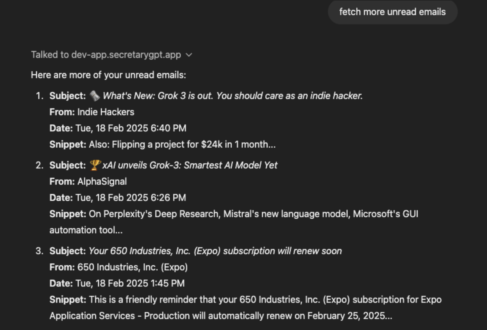
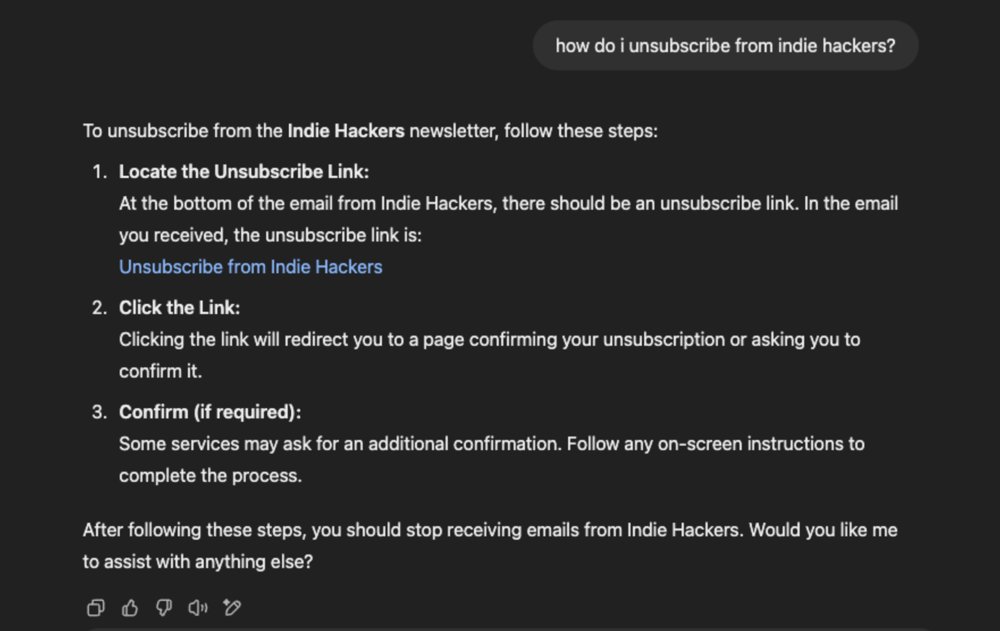

# SecretaryGPT

SecretaryGPT transforms ChatGPT into a personal assistant, helping busy professionals manage tasks and stay organized directly within ChatGPT conversations.

## Features

### ✅ Seamless Task Management
- 📝 Add tasks directly in ChatGPT using `@secretarygpt`
- 🗂️ Smart list categorization (e.g., shopping, work, personal)
- 🧠 Context-aware task organization

### 🔔 Intelligent Reminders
- ⏰ Set reminders within ChatGPT
- 📱 Cross-device notifications (if PWA installed)
- 📬 Web push and email notifications

## Usage

- 💬 Mention `@secretarygpt` in any conversation to manage tasks.
- 🗣️ Use natural language to create, edit, and organize tasks.
- 🔔 Set reminders and receive notifications across devices.

# Status

🚫 This project is not maintained and this is a shell repo to show off the work.
The code is not quite ready for open sourcing, if you are interested then shoot me an email.

